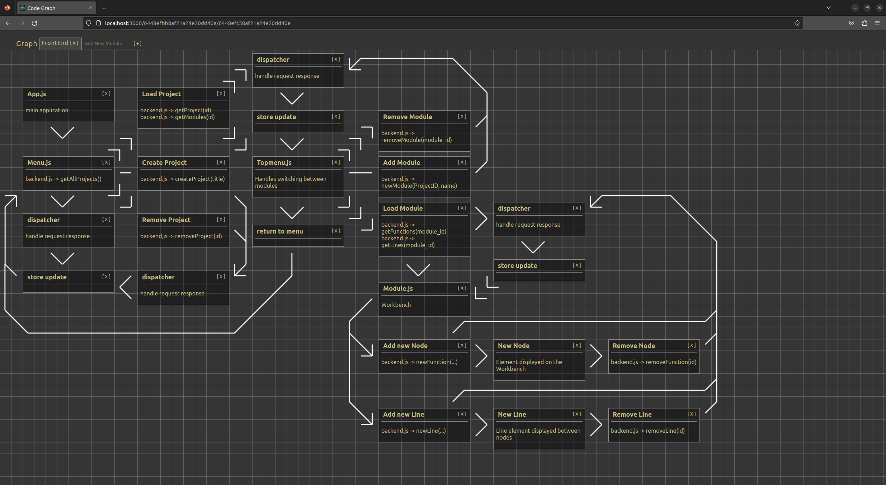

# Web User Interface Programming TTC8420-3003 Research Assignment

## Project: Node graph designer app

Front-End research project for drawing graphs in real time using React and GraphQL

[[Demo video]](https://youtu.be/O9zChu-WxAs)

   

## Known issues: 
- Project deletion does not delete the project content from database
- Line drawing is unreliable